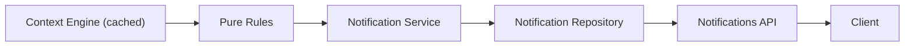

# Smart Notification Engine

## Routes

Both routes require the existing Bearer-token `get_current_user` dependency.

- `GET /notifications?type=weather&priority=high&unread_only=true&limit=20&offset=0`
- `PATCH /notifications/{notification_id}/read`

`GET` reads persisted notifications first. An empty feed is seeded from
`ContextCollectionService.cached(user_id)`, so it reuses the persisted live context
and never starts a new weather or calendar collection. Later reads preserve `read`.



Example response:

```json
{
  "count": 1,
  "total": 1,
  "notifications": [{
    "id": "b46d...",
    "title": "Friend's Wedding is coming up",
    "message": "Friend's Wedding is in 4 days. Plan your look early.",
    "type": "calendar",
    "priority": "medium",
    "icon": "calendar",
    "source": "calendar_rules",
    "created_at": "2026-07-22T10:00:00Z",
    "read": false,
    "metadata": {},
    "recommendation_context": {
      "occasion": "wedding",
      "weather": null,
      "category": "ethnic wear",
      "reason": "Friend's Wedding in 4 days"
    }
  }]
}
```

Calling `PATCH /notifications/{id}/read` returns `204 No Content`; later GETs return
the same deterministic notification with `read: true` (unless filtered out with
`unread_only=true`).

## Add a rule

1. Add a pure `def my_rule(context: ContextSnapshot) -> list[Notification]` in
   `apps/api/app/services/notification_rules.py`.
2. Use `_make_notification` so its ID remains a stable hash of its condition.
3. Add any threshold to `NotificationRuleConfig`, not inline in the rule.
4. Append the function to `DEFAULT_RULES` and add rule-specific tests.

Wishlist and order-history rules are intentional zero-output placeholders.

## Database and testing

Apply `database/migrations/011_smart_notifications.sql` using the project's normal
Supabase SQL migration workflow. It creates the new `public.notifications` table,
its indexes and RLS policy without altering any pre-existing table. The FK follows the active
application convention: `auth.users(id)`.

Run `pytest tests -q` from `apps/api` after installing `apps/api/requirements.txt`.
Open `/docs`, authorize with a Bearer token, then call the cached `/context/live`
endpoint before `GET /notifications` to seed a feed. `pytest` was added only as the
repository's first Python test runner; the application itself receives no new runtime
library beyond its existing FastAPI/Pydantic/SQLAlchemy dependencies.

Assumptions: the live-context cache has no formal TTL at the repository layer, so an
empty notification feed is seeded from the latest stored snapshot; scheduled refresh
can call `NotificationService` and `save_many` later. The historical `init.sql`
contains a legacy `notifications` shape; production must apply this new-table
migration on a database where that legacy bootstrap table has not been created, since
the requirement forbids altering existing tables.
